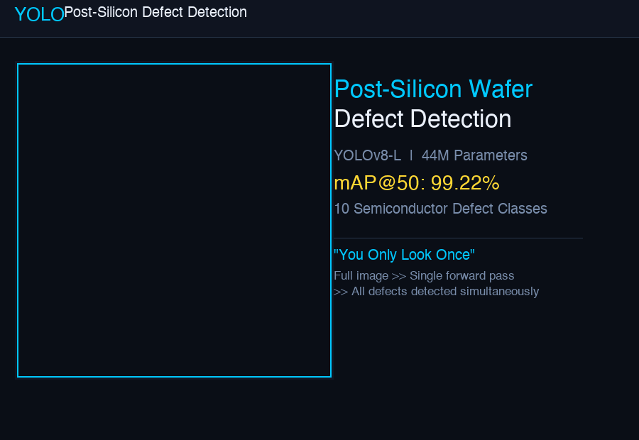
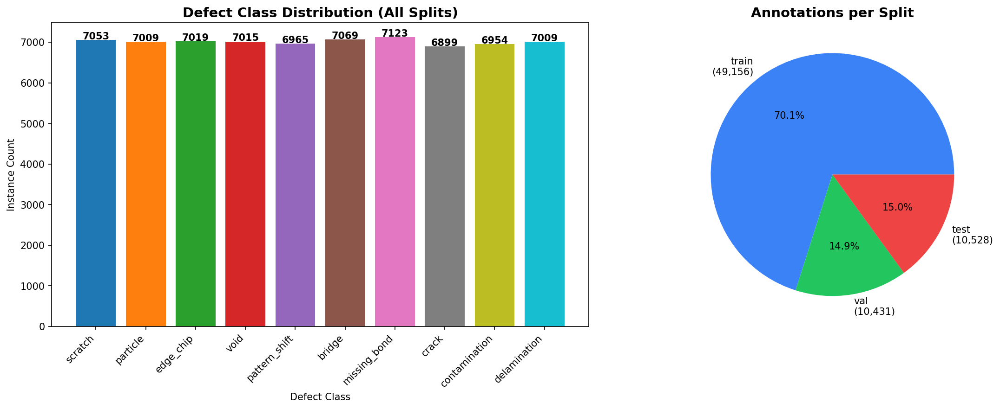
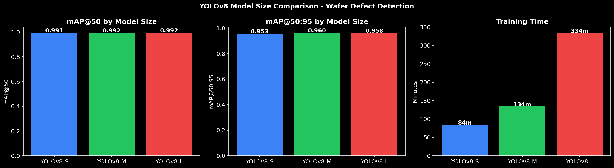
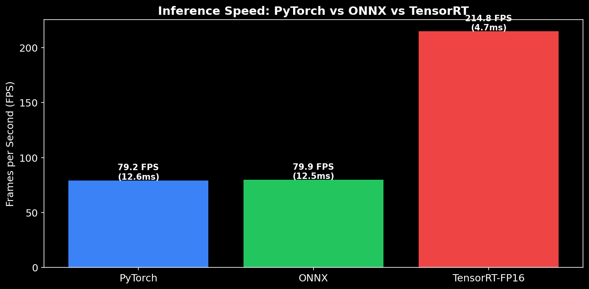
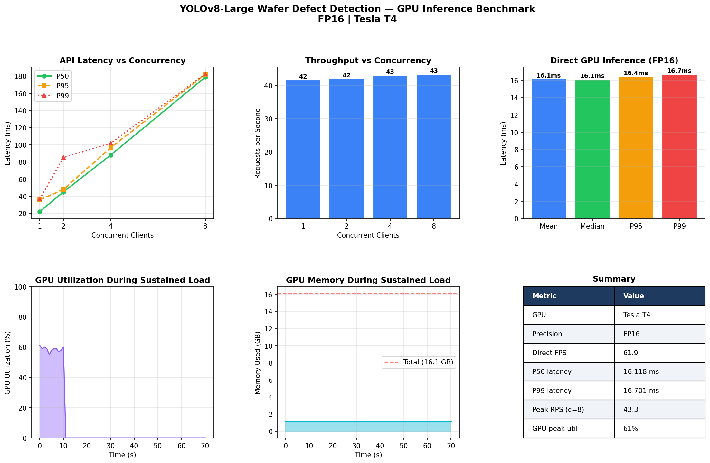
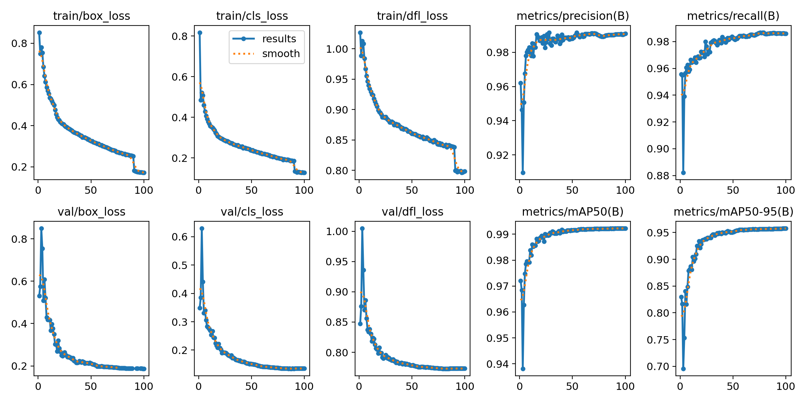
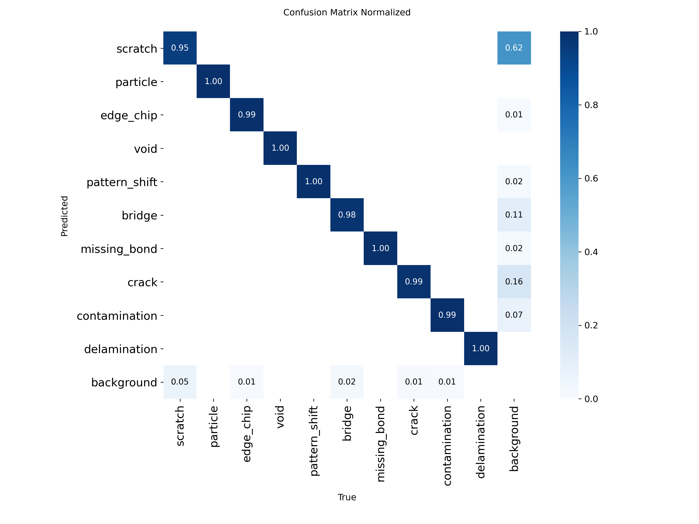
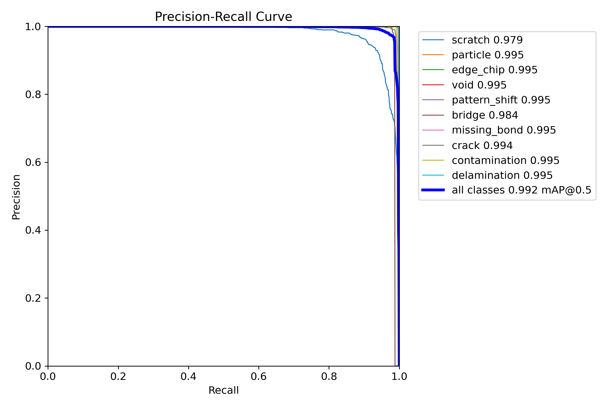
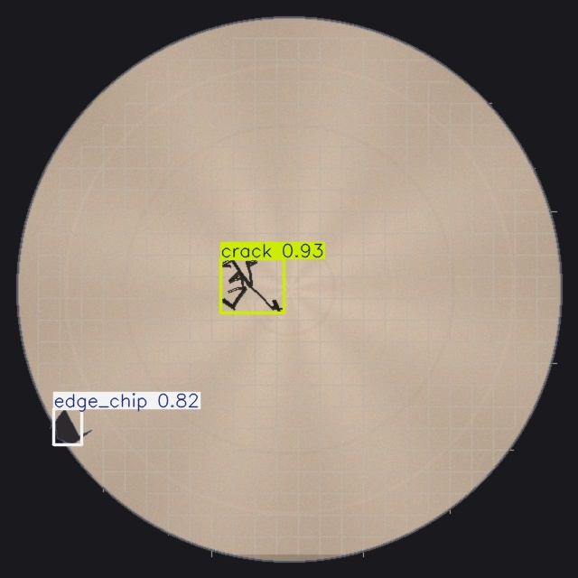
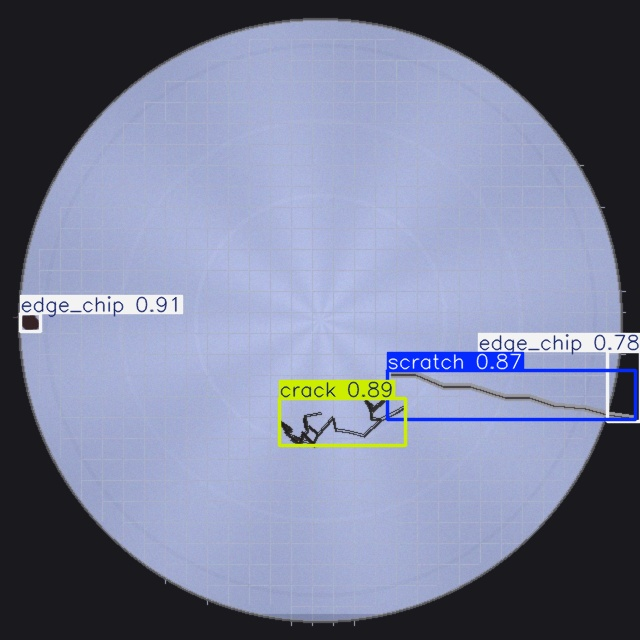

# YOLOv8 Wafer Defect Detection

Production-grade semiconductor wafer defect detection system using **YOLOv8-Large** (44M parameters). Trained on 20K+ synthetic defect images across 10 defect classes with MVTec AD real-world industrial defect integration. Deployed with NVIDIA Triton Inference Server, FastAPI, and React frontend.

<p align="center">
  
</p>

<p align="center"><em>How YOLO detects semiconductor wafer defects in a single forward pass</em></p>

---

## Key Results

| Metric | Value |
|--------|-------|
| **mAP@50** | 99.22% |
| **mAP@50:95** | 95.74% |
| **Precision** | 98.91% |
| **Recall** | 98.61% |
| **T4 FP16 Latency** | 16.1 ms / 62 FPS |
| **A100 TensorRT FP16** | 4.5 ms / 221 FPS |
| **Defect Classes** | 10 |
| **Model Parameters** | 43.7M |
| **Training Hardware** | NVIDIA A100-SXM4-80GB |

---

## How It Works

YOLO (You Only Look Once) processes the **entire image in a single forward pass** through a CNN. Unlike traditional detectors that scan an image hundreds of times with sliding windows, YOLO divides the image into a grid and predicts bounding boxes + class probabilities for all cells simultaneously.

<p align="center">
  
</p>

### Detection Pipeline

```
Input Image (640×640) → CNN Backbone → 13×13 Feature Grid → Simultaneous Prediction
    → Raw Candidate Boxes → Non-Max Suppression → Final Detections with Labels
```

### Architecture

```
┌──────────────┐     ┌──────────────┐     ┌───────────────┐     ┌──────────────┐
│  React UI    │────▶│  FastAPI      │────▶│  Triton /     │────▶│  YOLOv8-L    │
│  (TypeScript)│◀────│  Gateway      │◀────│  Ultralytics  │◀────│  ONNX Model  │
└──────────────┘     └──────────────┘     └───────────────┘     └──────────────┘
                            │                                          │
                     ┌──────┴──────┐                           ┌───────┴───────┐
                     │ Prometheus  │                           │   MLflow      │
                     │ + Grafana   │                           │   Tracking    │
                     └─────────────┘                           └───────────────┘
```

---

## Defect Classes

10 semiconductor-specific defect types covering the most common failure modes in wafer fabrication:

| ID | Class | Description |
|----|-------|-------------|
| 0 | scratch | Linear surface damage from handling |
| 1 | particle | Foreign material contamination |
| 2 | edge_chip | Chipping at wafer edges |
| 3 | void | Missing material / holes |
| 4 | pattern_shift | Lithography misalignment |
| 5 | bridge | Unintended metal connections |
| 6 | missing_bond | Failed wire bonds |
| 7 | crack | Structural fractures |
| 8 | contamination | Chemical residue |
| 9 | delamination | Layer separation |

<p align="center">
  
</p>

---

## Quick Start

### Prerequisites

- Python 3.10+
- Docker & Docker Compose (for full stack)
- NVIDIA GPU (recommended for training/inference, CPU fallback available)

### 1. Clone and Install

```bash
git clone https://github.com/Rajendar-Muddasani-2/yolo-object-detection.git
cd yolo-object-detection
python -m venv .venv && source .venv/bin/activate
pip install -r requirements.txt
```

### 2. Generate Synthetic Dataset

```bash
python -c "from src.data_generator import generate_dataset; generate_dataset('data/wafer_defects', n_images=1000)"
```

### 3. Train on GPU (Colab/Kaggle)

Upload `notebooks/train_yolov8_colab.ipynb` to Google Colab with A100/T4 runtime:
- Generates 20K images + MVTec AD integration
- Trains YOLOv8-Large for 100 epochs
- Compares S vs M vs L model variants
- Exports to ONNX + TensorRT with speed benchmarks

### 4. Run Inference (Local)

```bash
# Single image
python scripts/run_unseen_inference.py

# The script processes all images in outputs/realistic_unseen/
# Results saved to outputs/realistic_unseen/annotated/
```

### 5. Start the API Server

```bash
# Option A: Docker (recommended)
docker compose up api

# Option B: Direct
uvicorn src.api.server:app --host 0.0.0.0 --port 8080
```

### 6. Full Production Stack

```bash
docker compose up -d
```

| Service | Port | Description |
|---------|------|-------------|
| React Frontend | 3000 | Drag-and-drop detection UI |
| FastAPI Gateway | 8080 | REST API with `/detect` endpoint |
| Triton Server | 8000-8002 | GPU inference server (ONNX/TensorRT) |
| MLflow | 5000 | Experiment tracking |
| Prometheus | 9090 | Metrics collection |
| Grafana | 3001 | Monitoring dashboards |
| Redis | 6379 | Response caching |

---

## API Reference

### Detect Defects

```bash
curl -X POST http://localhost:8080/detect \
  -F "file=@wafer_image.jpg" \
  | python -m json.tool
```

**Response:**
```json
{
  "detections": [
    {"class": "crack", "confidence": 0.93, "bbox": [120, 340, 580, 410]},
    {"class": "edge_chip", "confidence": 0.91, "bbox": [45, 210, 95, 260]}
  ],
  "inference_time_ms": 16.1,
  "model": "yolov8l"
}
```

### All Endpoints

| Method | Endpoint | Description |
|--------|----------|-------------|
| POST | `/detect` | Detect defects in a single image |
| POST | `/detect/batch` | Batch detection (up to 16 images) |
| GET | `/health` | Service health check |
| GET | `/classes` | List all 10 defect classes |
| GET | `/metrics` | Prometheus metrics |

---

## Training Results

Trained on **NVIDIA A100-SXM4-80GB** (Google Colab). Dataset: 20K synthetic wafer defects + MVTec AD real industrial images (~25K total, 70/15/15 split).

### Model Comparison

| Model | mAP@50 | mAP@50:95 | Precision | Recall | Params | Training Time |
|-------|--------|-----------|-----------|--------|--------|---------------|
| YOLOv8-S | 99.10% | 95.25% | 98.62% | 97.93% | 11.2M | 84 min |
| YOLOv8-M | 99.16% | 96.05% | 98.76% | 98.36% | 25.9M | 134 min |
| **YOLOv8-L** | **99.22%** | **95.74%** | **98.91%** | **98.61%** | **43.7M** | **334 min** |

<p align="center">
  
</p>

### Speed Benchmark

| Backend | Hardware | Latency | FPS | Speedup |
|---------|----------|---------|-----|---------|
| PyTorch FP32 | A100 | 12.6 ms | 79 | 1.0x |
| ONNX Runtime | A100 | 12.5 ms | 80 | 1.0x |
| **PyTorch FP16** | **T4** | **16.1 ms** | **62** | — |
| **TensorRT FP16** | **A100** | **4.5 ms** | **221** | **2.8x** |

<p align="center">
  
</p>

### GPU Benchmark (Colab T4)

End-to-end GPU stress test on NVIDIA T4 (Google Colab) with FP16 inference via FastAPI server:

| Metric | Value |
|--------|-------|
| Direct Inference (P50) | 16.1 ms |
| Direct Inference (P99) | 16.7 ms |
| Throughput (FPS) | 62 |
| Load Test (c=1→8) | 41-43 rps, **0% errors** |
| Peak GPU Utilization | 61% |
| GPU Memory Used | 1.12 GB / 16.1 GB |
| GPU Temperature | 63-65°C |

<p align="center">
  
</p>
<p align="center"><em>6-panel benchmark: API latency vs concurrency, throughput scaling, direct inference, GPU utilization, memory, and summary</em></p>

### Training Curves

<p align="center">
  
</p>

### Confusion Matrix

<p align="center">
  
</p>

### Precision-Recall Curve

<p align="center">
  
</p>

---

## Inference on Unseen Data

Tested on realistic synthetic wafer images that the model never saw during training:

| Metric | Value |
|--------|-------|
| Images processed | 7 (realistic) + 20 (synthetic) |
| Detection rate | **100%** |
| Defect types found | scratch, crack, edge_chip, delamination, void, particle |
| CPU inference speed | 601 ms (Apple M3) |
| GPU inference speed | 16.1 ms (T4 FP16) / 4.5 ms (A100 TensorRT FP16) |

<p align="center">
  
  
</p>
<p align="center"><em>Left: crack (93%) + edge_chip (82%) | Right: edge_chip (91%) + crack (89%) + scratch (87%)</em></p>

---

## Project Structure

```
yolo-object-detection/
├── models/
│   ├── best.pt                     # YOLOv8-L trained weights (84 MB)
│   └── best.onnx                   # ONNX export (167 MB, Git LFS)
├── notebooks/
│   ├── train_yolov8_colab.ipynb    # GPU training notebook (Colab A100)
│   ├── colab_gpu_stack.ipynb       # GPU benchmark notebook (T4 FP16)
│   └── tensorrt_benchmark.ipynb    # TensorRT optimization benchmark (A100)
├── scripts/
│   ├── run_unseen_inference.py     # Run model on unseen images
│   ├── create_detection_gif.py     # Generate algorithm visualization GIF
│   └── generate_realistic_wafers.py # Photorealistic wafer image generator
├── src/
│   ├── data_generator.py           # 10-class synthetic defect generator
│   ├── mvtec_integration.py        # MVTec AD dataset converter + merger
│   ├── yolo_utils.py               # Detection utilities (export, benchmark)
│   └── api/
│       └── server.py               # FastAPI gateway (Triton + fallback)
├── frontend/                       # React + TypeScript + Vite
│   ├── src/App.tsx                 # Detection UI with canvas overlay
│   └── Dockerfile                  # Multi-stage Node → Nginx build
├── triton_model_repo/              # NVIDIA Triton model configuration
├── monitoring/                     # Prometheus + Grafana configs
├── tests/                          # pytest test suite
├── outputs/                        # Training artifacts, charts, inference results
├── docker-compose.yml              # 7-service production stack
├── Dockerfile                      # FastAPI container
├── requirements.txt                # Python dependencies
└── .github/workflows/ci.yml       # GitHub Actions lint + test
```

---

## Testing

```bash
# Install dev dependencies
pip install -e ".[dev]"

# Run test suite
pytest tests/ -v

# CI runs automatically on push/PR (Python 3.10, 3.11, 3.12)
```

---

## Model Files

| File | Size | Format | Description |
|------|------|--------|-------------|
| `models/best.pt` | 84 MB | PyTorch | Trained YOLOv8-L weights |
| `models/best.onnx` | 167 MB | ONNX (Git LFS) | Optimized for Triton/ONNX Runtime |

To use the ONNX model, ensure Git LFS is installed:
```bash
git lfs install
git lfs pull
```

---

## License

MIT
